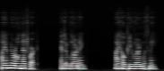

# Golang Mel Spectrogram

Audio-to-spectrogram and spectrogram-to-audio conversion library and command-line tools for Go.



## Features

- **Mel Spectrograms**: Perceptually-motivated frequency representation for audio processing
- **Phase-Preserving Spectrograms**: High-quality audio reconstruction without phase estimation
- **Bidirectional Conversion**: Audio → Spectrogram → Audio
- **Multiple Formats**: Support for WAV and FLAC input files
- **PNG Export**: Save spectrograms as images for visualization or ML applications

## Installation

```bash
go get github.com/neurlang/gomel
```

## Command-Line Tools

### tomel - Audio to Mel Spectrogram

Convert audio files to mel spectrogram images:

```bash
tomel <audio_file>
```

**Example:**
```bash
tomel glados-1609757458000_.wav
# Creates: glados-1609757458000_.wav.png
```

Supports `.wav` and `.flac` files. If no extension is provided, `.wav` is assumed.

### towav - Mel Spectrogram to Audio

Reconstruct audio from mel spectrogram images using Griffin-Lim algorithm:

```bash
towav <png_file> [sample_rate]
```

**Example:**
```bash
towav spectrogram.png 44100
# Creates: spectrogram.png.wav
```

Default sample rate: 44100 Hz

### tophase - Audio to Phase Spectrogram

Convert audio files to phase-preserving spectrogram images:

```bash
tophase <audio_file>
```

**Example:**
```bash
tophase audio.flac
# Creates: audio.flac.png
```

Phase spectrograms retain both magnitude and phase information for lossless reconstruction.

### fromphase - Phase Spectrogram to Audio

Reconstruct audio from phase-preserving spectrogram images:

```bash
fromphase <png_file> [sample_rate]
```

**Example:**
```bash
fromphase spectrogram.png 48000
# Creates: spectrogram.png.wav
```

Default sample rate: 44100 Hz

## Library API

### Mel Package

```go
import "github.com/neurlang/gomel/mel"

// Create mel spectrogram processor
m := mel.NewMel()

// Configure parameters
m.NumMels = 192              // Number of mel bands
m.MelFmin = 0                // Minimum frequency (Hz)
m.MelFmax = 16000            // Maximum frequency (Hz)
m.Window = 1280              // Window size
m.Resolut = 4096             // FFT resolution
m.GriffinLimIterations = 2   // Iterations for audio reconstruction
m.YReverse = true            // Reverse Y-axis in image
m.VolumeBoost = 0.0          // Volume adjustment for reconstruction
m.SampleRate = 44100         // Output sample rate

// Convert audio file to mel spectrogram image
err := m.ToMelWav("input.wav", "output.png")
err := m.ToMelFlac("input.flac", "output.png")

// Convert spectrogram image back to audio
err := m.ToWavPng("input.png", "output.wav")

// Low-level API: work with buffers
samples := mel.LoadWav("input.wav")
samples := mel.LoadFlac("input.flac")

melSpec, err := m.ToMel(samples)
audioSamples, err := m.FromMel(melSpec)

err := mel.SaveWav("output.wav", audioSamples, 44100)

// Get image buffer
imageData := m.Image(melSpec)
```

### Phase Package

```go
import "github.com/neurlang/gomel/phase"

// Create phase spectrogram processor
p := phase.NewPhase()

// Configure parameters
p.NumFreqs = 768             // Number of frequency bins
p.Window = 1280              // Window size
p.Resolut = 4096             // FFT resolution
p.YReverse = false           // Reverse Y-axis in image
p.VolumeBoost = 4.0          // Volume adjustment for reconstruction
p.SampleRate = 44100         // Output sample rate

// Convert audio file to phase spectrogram image
err := p.ToPhaseWav("input.wav", "output.png")
err := p.ToPhaseFlac("input.flac", "output.png")

// Convert spectrogram image back to audio
err := p.ToWavPng("input.png", "output.wav")

// Low-level API: work with buffers
samples := phase.LoadWav("input.wav")
samples := phase.LoadFlac("input.flac")

// Load with sample rate
samples, sampleRate, err := phase.LoadWavSampleRate("input.wav")
samples, sampleRate, err := phase.LoadFlacSampleRate("input.flac")

phaseSpec, err := p.ToPhase(samples)
audioSamples, err := p.FromPhase(phaseSpec)

err := phase.SaveWav("output.wav", audioSamples, 44100)

// Get image buffer
imageData := p.Image(phaseSpec)
```

## Mel vs Phase Spectrograms

| Feature | Mel Spectrogram | Phase Spectrogram |
|---------|----------------|-------------------|
| **Frequency Scale** | Perceptual (mel scale) | Linear |
| **Phase Information** | Lost | Preserved |
| **Reconstruction** | Griffin-Lim (iterative) | Direct (no iteration) |
| **Audio Quality** | Good for speech/music | Excellent, near-lossless |
| **Use Case** | ML/AI, speech recognition | High-fidelity audio processing |
| **File Size** | Smaller | Larger |

## Requirements

- Go 1.0 or higher

## Dependencies

- `github.com/faiface/beep` - Audio I/O
- `github.com/r9y9/gossp` - STFT implementation
- `github.com/mjibson/go-dsp` - FFT operations
- `github.com/mewkiz/flac` - FLAC decoding
- `github.com/x448/float16` - Float16 support

## License

See LICENSE file for details.
